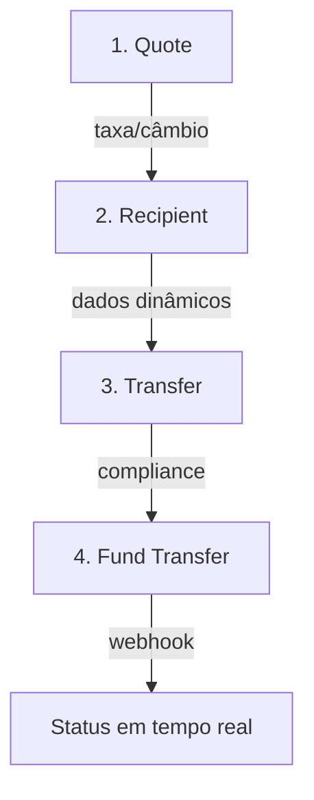

# Integração Wise Payout (Send Money API)

## 📋 Visão Geral

Este guia descreve a integração do **Wise Send Money** como um novo provedor de **payout** (transferências de saída) no sistema PNEUSLOJA.

### Diferença: Pay-in vs Pay-out

- **Pay-in (checkout)**: Receber dinheiro do cliente → **Blackcat** (mantém-se)
- **Pay-out (payout)**: Enviar dinheiro para alguém → **Wise** (novo)

A Wise é excelente para transferências, não para checkout direto de usuários.

---

## 🏗️ Arquitetura

```
PayoutProvider (interface abstrata)
    ├── BlackcatPayoutProvider (existente, se houver)
    └── WisePayoutProvider (novo)
        ├── createRecipient()
        ├── createQuote()
        ├── getTransferRequirements()
        ├── createTransfer()
        ├── fundTransfer()
        ├── getTransferStatus()
        └── handleWebhook()
```

### Abstração

A classe `WisePayoutService` implementa a interface `PayoutProvider`, permitindo trocar de provedor sem reescrever o checkout.

---

## 🔧 Configuração

### 1. Variáveis de Ambiente

Copie `.env.wise.example` para `.env.local` (ou seu arquivo de secrets):

```bash
cp .env.wise.example .env.local
```

**Edite com seus valores:**

```env
WISE_ENV=sandbox
WISE_BASE_URL=https://api.wise-sandbox.com
WISE_CLIENT_ID=seu_client_id_sandbox
WISE_CLIENT_SECRET=seu_client_secret_sandbox
WISE_WEBHOOK_SECRET=seu_webhook_secret
```

### 2. Obter Credenciais (Wise)

1. Acesse https://wise.com/ e faça login (ou crie conta)
2. Vá para **Account Settings** → **API tokens**
3. Para **OAuth 2.0 Client Credentials**:
   - Vá a **Settings** → **Developers** → **Create app**
   - Copie `client_id` e `client_secret`
   - Configure como `WISE_CLIENT_ID` e `WISE_CLIENT_SECRET`

### 3. Registrar Webhook

No painel Wise (Settings → Webhooks):

1. **Endpoint URL**: `https://seu-dominio.com/api/webhooks/wise`
2. **Events**: Selecionar `transfers#state-change`
3. Copie o `webhook_secret` para `WISE_WEBHOOK_SECRET`

---

## 🚀 Fluxo de Transferência (Send Money)

O fluxo tem 4-5 etapas:



### Etapa 1: Quote (Cotação)

```typescript
const quote = await wisePayoutService.createQuote({
  profileId: 123,
  sourceCurrency: 'BRL',
  targetCurrency: 'USD',
  sourceAmount: 1000,
});

// Resultado contém: taxa, fee, data de expiração
```

**Importante**: Quote tem validade (ex: 5-10min). Guardar `expiresAt` e respeitar.

### Etapa 2: Recipient (Beneficiário)

Antes de criar, descobrir **requisitos dinâmicos** (campos variam por país):

```typescript
const requirements = await wisePayoutService.validateRecipientRequirements(quote);

// requirements = [
//   { key: 'IBAN', type: 'text', label: 'IBAN', required: true },
//   { key: 'account_holder_name', type: 'text', label: 'Nome do titular', required: true },
//   ...
// ]
```

Depois criar o recipient:

```typescript
const recipient = await wisePayoutService.createRecipient({
  profileId: 123,
  currency: 'USD',
  type: 'iban',  // tipo depende de país/requisitos
  accountHolderName: 'John Doe',
  details: {
    IBAN: 'DE89370400440532013000',
    // ... outros campos dinâmicos
  },
});
```

**Dica BRL**: Se transferência envolver BRL, pode ser necesário `transferNature` (afeta IOF).

### Etapa 3: Requirements de Transfer (Compliance)

Antes de criar a transferência, validar requisitos de compliance:

```typescript
const transferRequirements = await wisePayoutService.getTransferRequirements({
  profileId: 123,
  quoteId: quote.id,
  recipientId: recipient.id,
  transferPurpose: 'payment_for_services',
  sourceOfFunds: 'business_income',
});

// transferRequirements = [
//   { key: 'transferPurpose', type: 'select', label: 'Propósito', required: true },
//   { key: 'sourceOfFunds', type: 'select', label: 'Origem dos fundos', required: true },
// ]
```

### Etapa 4: Create Transfer (Criar Transferência)

```typescript
const transfer = await wisePayoutService.createTransfer({
  profileId: 123,
  quote,
  recipient,
  customerTransactionId: 'unique-id-para-idempotencia', // ESSENCIAL!
  details: {
    transferPurpose: 'payment_for_services',
    sourceOfFunds: 'business_income',
  },
});

// transfer.id é o wise_transfer_id
// transfer.status começa como 'draft' ou 'pending_approval'
```

⚠️ **CRÍTICO**: `customerTransactionId` é único e **essencial para idempotência**. Se houver retry de rede/timeout, reusar o mesmo ID evita duplicação.

### Etapa 5: Fund Transfer (Fundear)

Executar a transferência (onde o dinheiro sai **de verdade**):

```typescript
// Opcional: verificar saldo antes
const balances = await wisePayoutService.checkBalance(profileId);

// Fundear via saldo
const funding = await wisePayoutService.fundTransfer({
  profileId: 123,
  transferId: transfer.id,
  method: 'BALANCE', // ou 'CARD', 'BANK_TRANSFER'
});

if (!funding.success && funding.message.includes('insufficient funds')) {
  // Aportar saldo e retentar
}
```

---

## 🔔 Webhooks (Acompanhamento em Tempo Real)

A Wise notifica mudanças de status via webhook.

### Event Type: `transfers#state-change`

Payload (exemplo):

```json
{
  "deliveryId": "webhook-123",
  "eventType": "transfers#state-change",
  "createdAt": "2026-02-11T10:00:00Z",
  "data": {
    "transferId": "12345",
    "status": "outgoing_payment_sent",
    "sourceAmount": 1000,
    "targetAmount": 950
  }
}
```

### Handler (Backend)

```typescript
// POST /api/webhooks/wise
app.post('/api/webhooks/wise', async (req, res) => {
  const payload = req.body;
  const signature = req.headers['x-signature-sha256'];

  try {
    await wisePayoutService.handleWebhook(payload, signature);
    res.status(200).json({ received: true });
  } catch (error) {
    // Responder 2xx de qualquer forma (Wise retentar se houver erro)
    res.status(202).json({ error: error.message });
  }
});
```

**Importante**: Responder **2xx em até 5 segundos**, senão Wise considera falha e retentar (até 25 vezes em ~2 semanas).

**Strategy**: Validar assinatura, persistir evento, processar assincronamente.

---

## 🗄️ Persistência (Banco de Dados)

### Tabelas Criadas

1. **wise_recipients**: Beneficiários cadastrados
2. **wise_quotes**: Cotações com taxa/câmbio
3. **wise_transfers**: Transferências em andamento
4. **webhook_events**: Auditoria de eventos recebidos
5. **payout_provider_config**: Feature flags

### Exemplo: Rastreamento de Transfer

```sql
SELECT 
  wt.id,
  wt.wise_transfer_id,
  wt.customer_transaction_id,
  wt.status,
  wt.source_amount,
  wt.source_currency,
  wt.target_amount,
  wt.target_currency,
  wt.created_at,
  wt.updated_at
FROM wise_transfers wt
WHERE wt.usuario_id = 'user-123'
ORDER BY wt.created_at DESC;
```

---

## 🧪 Testes no Sandbox

### Checklist de Teste

1. ✅ Criar quote (BRL → USD, por exemplo)
2. ✅ Descobrir requisitos de recipient (rodar para seu país)
3. ✅ Criar recipient (com dados reais da sua conta de teste)
4. ✅ Validar requisitos de transfer
5. ✅ Criar transfer
6. ✅ Fundear transfer (via saldo sandbox)
7. ✅ Receber webhook de state-change
8. ✅ Testar idempotência (reusar `customerTransactionId`)

### Código de Teste Básico

```typescript
import { wisePayoutService } from '@/services/wiseService';

async function testWiseFlow() {
  try {
    // 1. Quote
    const quote = await wisePayoutService.createQuote({
      profileId: 123,
      sourceCurrency: 'BRL',
      targetCurrency: 'USD',
      sourceAmount: 100,
    });
    console.log('Quote:', quote);

    // 2. Requirements
    const recipientReqs = await wisePayoutService.validateRecipientRequirements(quote);
    console.log('Recipient Requirements:', recipientReqs);

    // 3. Recipient
    const recipient = await wisePayoutService.createRecipient({
      profileId: 123,
      currency: 'USD',
      type: 'iban',
      accountHolderName: 'Test User',
      details: {
        IBAN: 'DE89370400440532013000',
      },
    });
    console.log('Recipient:', recipient);

    // 4. Transfer Requirements
    const transferReqs = await wisePayoutService.getTransferRequirements({
      profileId: 123,
      quoteId: quote.id,
      recipientId: recipient.id,
    });
    console.log('Transfer Requirements:', transferReqs);

    // 5. Transfer
    const transfer = await wisePayoutService.createTransfer({
      profileId: 123,
      quote,
      recipient,
      customerTransactionId: `test-${Date.now()}`,
    });
    console.log('Transfer:', transfer);

    // 6. Fund
    const funding = await wisePayoutService.fundTransfer({
      profileId: 123,
      transferId: transfer.id,
      method: 'BALANCE',
    });
    console.log('Funding:', funding);
  } catch (error) {
    console.error('Erro no fluxo Wise:', error);
  }
}

testWiseFlow();
```

---

## ⚙️ Feature Flags & Roteamento

Use `payout_provider_config` para alternar provedores:

```typescript
// Pseudocódigo: roteador de provedor
async function getPayoutProvider(config?: { currency?: string; amount?: number }) {
  const routes = await supabase
    .from('payout_provider_config')
    .select('*')
    .eq('enabled', true)
    .order('priority', { ascending: false });

  // Lógica customizável:
  // - Se USD, preferir Wise
  // - Se BRL, preferir Blackcat (se existir payout lá)
  // - Se > 10k, exigir Wise (compliance)

  if (config?.currency === 'USD') {
    return wisePayoutService;
  }

  return blackcatPayoutProvider; // fallback
}
```

---

## 📊 Acompanhamento de Status (Webhook + Polling)

### Estados de Transfer

- `draft`: Criado, mas não ativo
- `pending_approval`: Aguardando aprovação (compliance)
- `active`: Pronto para funding
- `processing`: Sendo processado
- `outgoing_payment_sent`: Dinheiro saiu (sucesso!)
- `funds_returned`: Bounce (conta invalida, etc.)
- `cancelled`: Cancelado pelo usuário

### Reconciliação

Manter seu BD atualizado:

```typescript
// Via webhook (recomendado)
if (webhookPayload.eventType === 'transfers#state-change') {
  await updateTransferStatus(
    webhookPayload.data.transferId,
    webhookPayload.data.status
  );
}

// Via polling (fallback)
setInterval(async () => {
  const transfers = await supabase
    .from('wise_transfers')
    .select('wise_transfer_id, status')
    .in('status', ['draft', 'pending_approval', 'active', 'processing'])
    .order('updated_at', { ascending: true })
    .limit(50);

  for (const transfer of transfers.data || []) {
    const status = await wisePayoutService.getTransferStatus(
      transfer.wise_transfer_id
    );
    if (status.status !== transfer.status) {
      // Atualizar
    }
  }
}, 60000); // A cada 1min
```

---

## 🔒 Segurança

### CORS & Certificados

- **mTLS** (mutual TLS) é opcional para sandbox, **obrigatório** para embedded payouts em produção
- Se usar mTLS, configure `WISE_MTLS_CERT_PATH` e `WISE_MTLS_KEY_PATH`

### Validação de Webhook

```typescript
// Implementado em wisePayoutService.validateWebhookSignature()
const isValid = wisePayoutService.validateWebhookSignature(
  JSON.stringify(payload),
  req.headers['x-signature-sha256']
);

if (!isValid) {
  console.warn('Webhook inválido!');
  return res.status(401).json({ error: 'Invalid signature' });
}
```

### Idempotência

**Essencial**: Sempre gerar e guardar `customerTransactionId` único.

```typescript
import { v4 as uuidv4 } from 'uuid';

const transfer = await wisePayoutService.createTransfer({
  // ...
  customerTransactionId: uuidv4(),
});
```

Se houver erro de rede/timeout e retentar, reusar o mesmo ID evita duplicação.

---

## 📈 Migração Gradual (Rollout)

1. **Fase 1**: Integrar no sandbox, testar toda a jornada
2. **Fase 2**: Deploy em produção, DESABILITADO (feature flag `WISE_PAYOUT_ENABLED=false`)
3. **Fase 3**: Ativar para 10% dos usuários (ou manuellement para admin)
4. **Fase 4**: Monitorar taxa de sucesso, latência, divergências
5. **Fase 5**: Aumentar para 100% ou manter Blackcat se for pay-in

### Métricas a Acompanhar

- Taxa de sucesso (quotes, transfers, funding)
- Tempo médio por estado
- Bounce rate (funds_returned)
- Divergências de reconciliação

---

## 🐛 Troubleshooting

### Erro: "insufficient funds"

```
action: Fazer aporte na conta Wise (saldo), depois retentar fundTransfer()
```

### Erro: "quote expired"

```
action: Gerar nova quote (a anterior expirou)
```

### Erro: "requirements not met"

```
action: Implementação de requirements dinâmicos (ver etapa 2)
```

### Webhook não chegando

1. Verificar **Webhook URL** está acessível (não localhost)
2. Verificar **Webhook Secret** está correto
3. Teste via Wise dashboard → "Resend webhook"
4. Logs: supabase → webhook_events table

---

## 📚 Referências

- [Wise Send Money API Docs](https://docs.wise.com/guides/product/send-money)
- [Wise OAuth 2.0](https://docs.wise.com/guides/onboarding/oauth/setup)
- [Wise Webhooks](https://docs.wise.com/guides/webhook)
- [Wise Requirements API](https://docs.wise.com/guides/api/requirements-api)

---

## ✅ Checklist: Deploy em Produção

- [ ] Credenciais Wise (production) geradas e configuradas
- [ ] Webhook URL registrado na Wise (produção)
- [ ] Certificados mTLS (se usando embedded)
- [ ] Feature flag `WISE_PAYOUT_ENABLED=true` ativado
- [ ] RLS policies no Supabase ativadas
- [ ] Testes end-to-end no sandbox ✅
- [ ] Logs e monitoramento configurado
- [ ] Runbook de troubleshooting criado
- [ ] Backup/recovery plan para fundos
- [ ] Comunicação com Wise support ativa

---

**Implementação inicial**: 11 de fevereiro de 2026
**Última atualização**: 11 de fevereiro de 2026

